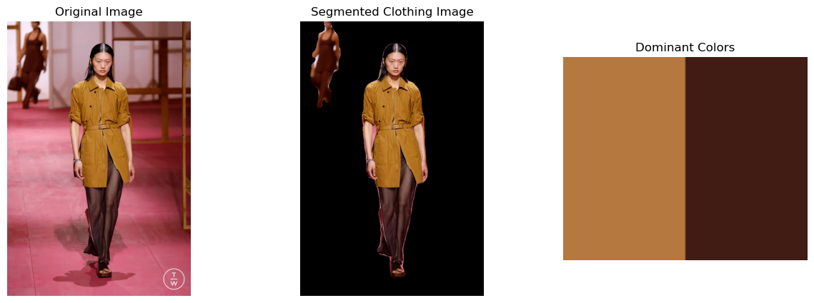
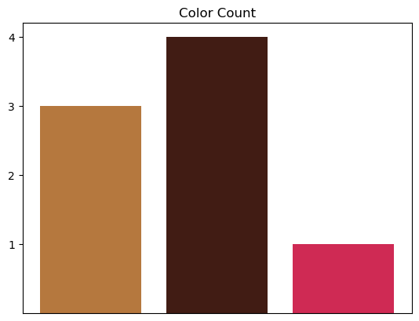

# Color Count for Runway Images
## Overview
This machine learning project utilizes PyTorch and DeepLabV3 to analyze runway images and count the most trending colors in fashion. It processes images, extracts color information, and saves the results in a bar graph, allowing you to easily see the colors used and their frequency.

## Documents
**- /data:** folder with try out images from Hermes' runway show for Spring/Summer 2025

**- color.py:** python file where you can list your images and the graph will be saved on your computer

**- color_count_notebook.ipynb:** notebook file with the same code, visualizations examples

**- /readmedocs:** folder with images used in this readme file

**- README.md:** this readme file

## Visualization Examples
In this code, you can see the original image, the segmented image and the extracted colors in one image, like this:

This visualization is not automatically saved on your computer, you can always do it manually.

The final output, the bar chart that gets saved on your computer, might look like this (it will depend con the number of colores extracted for the images):

Remember you can always edit the chart on the code, changing the titles, and adding color on the color palette on the first visualization.

## Tools
- Python
- Pytorch
- Matplotlib
- DeeplabV3
- Numpy

## Credit
The images used as example in this code belong to Tag Walk - they were taken in Hermes' Spring/Summer 2025 show. 
